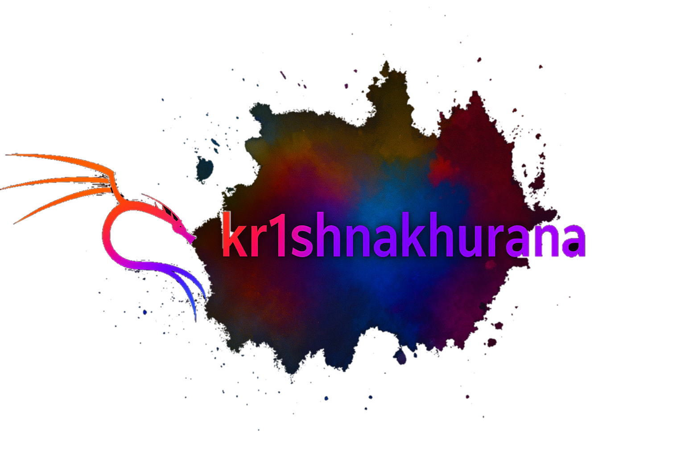

<!-- Banner -->
<p align="center">
  
</p>

<!-- Typing SVG -->
<p align="center">
  
</p>

---

<h2 align="center">👨‍💻 About Me</h2>

```js
const krishna = {
  name: "KR1SHNAAKHURANA",
  role: "Developer / Creator",
  code: ["JavaScript", "Python", "Java", "HTML", "CSS"],
  hobbies: ["Hacking UI", "Music", "Gaming", "AI Experiments"],
  currentFocus: "Building dark-aesthetic dev tools ⚡",
  motto: "while(alive) { code(); }"
};
```
---
<h2 align="center">🧠 Tech Stack</h2> <p align="center">  </p>

<h2 align="center">📈 My GitHub Stats</h2> <p align="center">   </p> <p align="center">  </p>

<h2 align="center">🏆 Achievements</h2> <p align="center">  </p>

<h2 align="center">⚙️ Most Used Languages</h2> <p align="center">  </p>

<h2 align="center">🚀 Projects & Experiments</h2> <ul align="center"> <li>🧩 <b>Hexa Discord Bot</b> — Full moderation + music system with JSON stocks.</li> <li>💸 <b>Invoice Builder</b> — Python + Tkinter app for local business billing.</li> <li>💻 <b>BIN Validator</b> — Java Swing real-time BIN lookup tool.</li> <li>🎵 <b>Lyrica</b> — Aesthetic Lo-Fi Discord music bot.</li> </ul>

<h2 align="center">💬 Connect With Me</h2> <p align="center"> <a href="https://github.com/kr1shnaakhurana"></a> <a href="https://linkedin.com/in/kr1shnaakhurana"></a> <a href="https://twitter.com/kr1shnaakhurana"></a> <a href="mailto:kr1shnaakhurana@proton.me"></a> </p>


<h2 align="center">🧩 Fun Zone</h2>

<p align="center">
  <a href="https://github.com/kr1shnaakhurana">
    
  </a>
</p>

<a href="https://skyline.github.com/kr1shnaakhurana" target="_blank">
  
</a>

  
</p>


<h3 align="center">⚡ "Code. Sleep. Repeat." ⚡</h3> 
